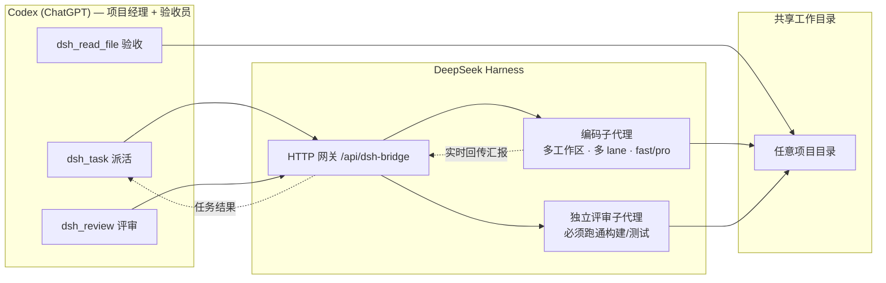

# DSH Collab — Codex × DeepSeek Harness 双向编码协作

**Codex 主导，DeepSeek 执行，Codex 验收。** 一个插件体系，让 ChatGPT（Codex）像项目经理一样把编码任务派给本机 DeepSeek Harness 的编码子代理，实时回传结果，读文件验收，并由独立评审员实际跑通构建/测试后出具评审报告。

```
Codex 工作区 (ChatGPT)
   │  派活 / 评审 / 验收
   ▼
DeepSeek Harness 网关 ── 编码子代理（多工作区、多 lane、fast/pro 模型）
   │                     独立评审子代理（必须跑通构建/测试）
   ▼
共享工作目录（任意目录，--cwd 指定）
```



---

## 组件

| 目录 | 内容 | 说明 |
|---|---|---|
| `codex-plugin/` | Codex 本地市场插件包 | 标准 marketplace 结构（`.agents/plugins/marketplace.json` + 插件目录），含协作技能 `dsh-collab` |
| `mcp/dsh-mcp.mjs` | MCP 服务器（零依赖 Node） | stdio 传输（Codex `[mcp_servers]` 直连）+ Streamable HTTP 传输（`--http`，供 Secure MCP Tunnel / cloudflared 桥接 ChatGPT）；5 个工具：`dsh_task` / `dsh_task_status` / `dsh_task_cancel` / `dsh_review` / `dsh_read_file` |
| `harness/dsh-bridge.mjs` | DeepSeek Harness 宿主组合网关插件 | 提供 HTTP 网关（`/api/dsh-bridge/*`）、WS 推送、原生工具，管理编码/评审子代理会话。**必须装进 harness 宿主组合**（见下文） |

## 功能

- **派活**：`dsh_task` / `task.mjs`，任意工作目录（`--cwd`，不存在自动创建并注册为工作区）
- **并行分工**：同目录多 lane（`--lane`）+ 跨目录天然并行
- **模型切换**：`fast`（deepseek-v4-flash）或 `pro`（deepseek-v4-pro），动态解析不写死
- **双向评审**：独立评审子代理与编码员分离，读磁盘真实文件、静态审查、**实际运行构建/测试验证可跑通**，输出结构化报告
- **Git 自动提交**：`--commit`，任务完成后在 cwd 自动 `git add -A` 并提交
- **跨任务记忆**：持久子代理会话 + 历史摘要注入（冷恢复失败自动降级为一次性执行，功能不中断）
- **任务管理**：`--list` / `--status <id>` / `--cancel <id>`
- **结果回传**：任务汇报直接回 Codex 对话（`--wait` 默认）

## 安装

### 1. DeepSeek Harness 网关（必需，后端）

把 `harness/dsh-bridge.mjs` 复制到你的 dsh profile 目录（例如 `$DSH_HOME/profiles/web/`），并在该目录的 `cordis.patch.yml` 中追加：

```yaml
- insert:
    - id: dsh-bridge
      name: './dsh-bridge.mjs'
```

重启 harness。默认共享工作目录为 `D:\Harness`，可用环境变量 `DSH_BRIDGE_WORKSPACE` 覆盖。验证：

```
GET http://127.0.0.1:3080/api/dsh-bridge/status
```

### 2. Codex 侧（二选一或都用）

**A. MCP 工具（推荐，走 Codex 官方通道）**：把 `mcp/dsh-mcp.mjs` 放到本机任意位置，在 `~/.codex/config.toml` 追加：

```toml
[mcp_servers.dsh]
command = 'node'
args = ['<绝对路径>/dsh-mcp.mjs']
startup_timeout_sec = 120
```

重启 Codex，会话中出现 `mcp__dsh__*` 工具。

**B. 本地市场插件（技能形式）**：把 `codex-plugin/` 放到任意位置，在个人市场清单 `~/.agents/plugins/marketplace.json` 中追加插件条目（`"path": "./plugins/dsh"`），并把插件目录放到 `~/plugins/dsh/`，然后：

```bash
codex plugin add dsh@personal
```

> ⚠️ 已知问题：Codex Desktop 26.803 在 Windows 上存在插件技能不注入会话的 bug（[openai/codex#26037](https://github.com/openai/codex/issues/26037)、[#22078](https://github.com/openai/codex/issues/22078)）。技能形式可能不生效，**以 MCP 方式为准**。

### 3. ChatGPT 普通聊天区（可选，受账户限制）

ChatGPT 不能直连 localhost MCP。官方通道是 [Secure MCP Tunnel](https://github.com/openai/tunnel-client)：

1. 在 `https://platform.openai.com/settings/organization/tunnels` 创建隧道（需组织上下文），创建 Runtime API key；
2. 启动本地 HTTP MCP：`node dsh-mcp.mjs --http 127.0.0.1:4800`；
3. 启动隧道客户端（含 `HTTPS_PROXY` 环境变量若需代理）：

```bash
tunnel-client init --sample sample_mcp_remote_no_auth --profile dsh --tunnel-id tunnel_xxx --mcp-server-url http://127.0.0.1:4800/mcp
tunnel-client run --profile dsh
```

4. ChatGPT → 设置 → Connectors 中连接。

> 注意：写入型 MCP 工具对 ChatGPT 个人订阅（Plus）的开放度存在产品级限制，此路径仅供有能力/有组织的账户使用。

## 使用

**Codex 工作区会话**（MCP 工具就绪后）：

> 用 dsh_task 让 DeepSeek 生成一个随机密码 CLI + 测试 + README，放在当前项目目录，完成后你用 dsh_read_file 验收，再 dsh_review 评审

**命令行**（等价脚本，位于插件 `skills/dsh-collab/scripts/`）：

```bash
node task.mjs --in "<指令>" --cwd "<目录>" [--lane backend] [--model fast|pro] [--commit]
node review.mjs --cwd "<目录>" [--diff git|@文件|"diff文本"] [--focus "<重点>"]
node task.mjs --list | --status <taskId> | --cancel <taskId>
```

## 环境变量

| 变量 | 默认 | 说明 |
|---|---|---|
| `DSH_BRIDGE_URL` | `http://127.0.0.1:3080` | 网关地址 |
| `DSH_BRIDGE_WORKSPACE` | `D:\Harness` | 网关默认共享工作目录 |
| `DSH_BRIDGE_ROOT` | `D:\Harness` | `dsh_read_file` 相对路径基准 |
| `DSH_BRIDGE_HISTORY` | 多级降级 | 协作历史文件位置（默认 D 盘 → 用户目录 → 临时目录逐级降级） |

## 已知限制

- Codex Desktop Windows 本地市场技能注入 bug（见上，MCP 通道不受影响）
- 动态插件环境无 `AbortSignal`，冷恢复失败时自动降级为一次性执行；宿主组合持久化版无此问题
- ChatGPT Plus 写入型 MCP 的开放度取决于 OpenAI 产品策略

## License

MIT
