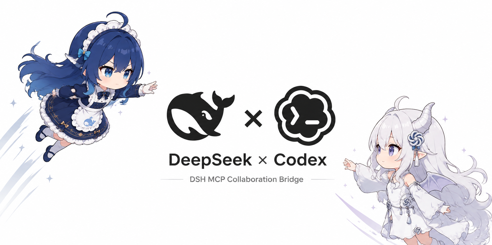
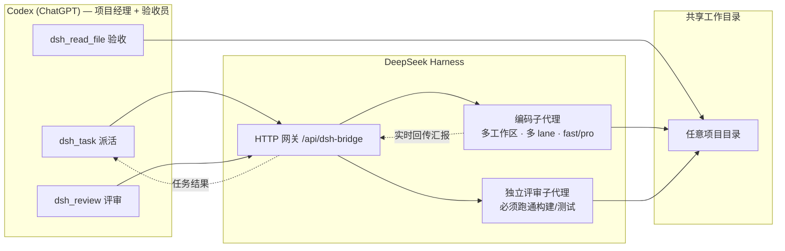

<p align="center">
  
</p>

# DSH Collab — Codex × DeepSeek Harness 双向编码协作

**Codex 主导，DeepSeek 执行，Codex 验收。** 一个插件体系，让 ChatGPT（Codex）像项目经理一样把编码任务派给本机 DeepSeek Harness 的编码子代理，实时回传结果，读文件验收，并由独立评审员实际跑通构建/测试后出具评审报告。

```
Codex 工作区 (ChatGPT)
   │  派活 / 评审 / 验收
   ▼
DeepSeek Harness 网关 ── 编码子代理（多工作区、多 lane、fast/pro 模型）
   │                     独立评审子代理（必须跑通构建/测试）
   ▼
共享工作目录（任意目录，--cwd 指定）
```



---

## 组件

| 目录 | 内容 | 说明 |
|---|---|---|
| `codex-plugin/` | Codex 本地市场插件包 | 标准 marketplace 结构（`.agents/plugins/marketplace.json` + 插件目录），含协作技能 `dsh-collab` |
| `mcp/dsh-mcp.mjs` | MCP 服务器（零依赖 Node） | stdio 传输（Codex `[mcp_servers]` 直连）+ Streamable HTTP 传输（`--http`，供 Secure MCP Tunnel / cloudflared 桥接 ChatGPT）；6 个工具：`dsh_task` / `dsh_sessions` / `dsh_task_status` / `dsh_task_cancel` / `dsh_review` / `dsh_read_file` |
| `harness/dsh-bridge.mjs` | DeepSeek Harness 宿主组合网关插件 | 提供 HTTP 网关（`/api/dsh-bridge/*`）、WS 推送、原生工具，管理编码/评审子代理会话。**必须装进 harness 宿主组合**（见下文） |
| `cordis.patch.yml` | bundle patch | 把网关插件挂进 DSH 宿主组合；`dsh.bundle.patch` 指向它，所以 `dsh plugin add` 能自动 reconcile |

## 功能

- **派活**：`dsh_task` / `task.mjs`，任意工作目录（`--cwd`，不存在自动创建并注册为工作区）
- **接进已有会话**：`dsh_sessions` 只读搜索既有会话 → `dsh_task --session <id>` 把指令投递进去（`queue` 排队 / `steer` 插入当前回合）。**不新建会话、不新建工作区**；"找不到/接不上"一律返回稳定 reason 而不是静默新建
- **并行分工**：同目录多 lane（`--lane`）+ 跨目录天然并行
- **模型切换**：`fast`（deepseek-v4-flash）或 `pro`（deepseek-v4-pro），动态解析不写死
- **双向评审**：独立评审子代理与编码员分离，读磁盘真实文件、静态审查、**实际运行构建/测试验证可跑通**，输出结构化报告
- **Git 自动提交**：`--commit`，任务完成后在 cwd 自动 `git add -A` 并提交
- **跨任务记忆**：持久子代理会话 + 历史摘要注入（冷恢复失败自动降级为一次性执行，功能不中断）
- **任务管理**：`--list` / `--status <id>` / `--cancel <id> [--force]`
- **结果回传**：任务汇报直接回 Codex 对话（`--wait` 默认）；每个任务响应都回显 `target`，一眼看出是"新建"还是"接进哪条会话"

## 安装

### 0. 一条命令装全部（推荐，npm）

```sh
# 1) 网关插件装进 harness profile（自动 reconcile bundles，无需手工复制文件）
dsh plugin --profile web add @whaletalk/dsh-codex-collab

# 2) MCP 服务器交给 Codex
npm install -g @whaletalk/dsh-codex-collab
```

之后 `dsh-mcp` / `dsh-task` / `dsh-review` 三个命令进入 PATH，`~/.codex/config.toml` 里写：

```toml
[mcp_servers.dsh]
command = 'dsh-mcp'
startup_timeout_sec = 120
```

装完**必须重启 profile 进程**——`dsh plugin add` 改的是 bundles 列表与 node_modules，HMR 不监控这两处。

> 本包只提供 bundle patch，不含 profile 之外的强依赖：`@deepseek-ai/dsh-tools` 是 optional peer，由 DSH 安装树在运行时提供。因此 `npm install` 不会去 registry 拉它，也不会因它缺失而报错。

<details>
<summary>不想用 npm？仍可手工安装（源码方式）</summary>

### 1. DeepSeek Harness 网关（必需，后端）

把 `harness/dsh-bridge.mjs` 复制到你的 dsh profile 目录（例如 `$DSH_HOME/profiles/web/`），并在该目录的 `cordis.patch.yml` 中追加：

```yaml
- insert:
    - id: dsh-bridge
      name: './dsh-bridge.mjs'
```

重启 harness。默认共享工作目录为 `D:\Harness`，可用环境变量 `DSH_BRIDGE_WORKSPACE` 覆盖。验证：

```
GET http://127.0.0.1:3080/api/dsh-bridge/status
```

> 手工方式必须用相对路径 `'./dsh-bridge.mjs'`，因为文件就在 profile 目录里；npm 方式则用包子路径 `@whaletalk/dsh-codex-collab/bridge`，两者不要混用。

### 2. Codex 侧（二选一或都用）

**A. MCP 工具（推荐，走 Codex 官方通道）**：把 `mcp/dsh-mcp.mjs` 放到本机任意位置，在 `~/.codex/config.toml` 追加：

```toml
[mcp_servers.dsh]
command = 'node'
args = ['<绝对路径>/dsh-mcp.mjs']
startup_timeout_sec = 120
```

重启 Codex，会话中出现 `mcp__dsh__*` 工具。

**B. 本地市场插件（技能形式）**：把 `codex-plugin/` 放到任意位置，在个人市场清单 `~/.agents/plugins/marketplace.json` 中追加插件条目（`"path": "./plugins/dsh"`），并把插件目录放到 `~/plugins/dsh/`，然后：

```bash
codex plugin add dsh@personal
```

npm 安装后，插件目录已在包内，用一行拿到绝对路径：

```bash
node -p "require.resolve('@whaletalk/dsh-codex-collab/package.json').replace(/package\.json$/,'codex-plugin')"
```

> ⚠️ 已知问题：Codex Desktop 26.803 在 Windows 上存在插件技能不注入会话的 bug（[openai/codex#26037](https://github.com/openai/codex/issues/26037)、[#22078](https://github.com/openai/codex/issues/22078)）。技能形式可能不生效，**以 MCP 方式为准**。

### 3. ChatGPT 普通聊天区（可选，受账户限制）

ChatGPT 不能直连 localhost MCP。官方通道是 [Secure MCP Tunnel](https://github.com/openai/tunnel-client)：

1. 在 `https://platform.openai.com/settings/organization/tunnels` 创建隧道（需组织上下文），创建 Runtime API key；
2. 启动本地 HTTP MCP：`node dsh-mcp.mjs --http 127.0.0.1:4800`；
3. 启动隧道客户端（含 `HTTPS_PROXY` 环境变量若需代理）：

```bash
tunnel-client init --sample sample_mcp_remote_no_auth --profile dsh --tunnel-id tunnel_xxx --mcp-server-url http://127.0.0.1:4800/mcp
tunnel-client run --profile dsh
```

4. ChatGPT → 设置 → Connectors 中连接。

> 注意：写入型 MCP 工具对 ChatGPT 个人订阅（Plus）的开放度存在产品级限制，此路径仅供有能力/有组织的账户使用。

</details>

## 使用

**Codex 工作区会话**（MCP 工具就绪后）：

> 用 dsh_task 让 DeepSeek 生成一个随机密码 CLI + 测试 + README，放在当前项目目录，完成后你用 dsh_read_file 验收，再 dsh_review 评审

**命令行**（npm 安装后直接用；源码方式用 `node <脚本路径>`）：

```bash
# 新建子代理（原有行为）
dsh-task --in "<指令>" --cwd "<目录>" [--lane backend] [--model fast|pro] [--commit]

# 接进已有会话：先找，再派
dsh-task --sessions "<标题关键词>"                    # 只读列候选，拿 sessionId
dsh-task --in "<指令>" --session "<sessionId>" [--steer]
dsh-task --in "<指令>" --find "<标题关键词>"           # 唯一命中才派；否则退出码 4

dsh-review --cwd "<目录>" [--diff git|@文件|"diff文本"] [--focus "<重点>"]
dsh-task --list | --status <taskId> | --cancel <taskId> [--force]
```

**已有会话派活**（对应"接进我正在用的那条对话"）：

```bash
# 1) 找到（只读，不创建任何东西）
dsh-task --sessions "按文档启动OKX策略实验计划"
# → {"items":[{"sessionId":"session-8d481ad9-...","snippet":"@okx-strategy-lab/ 开始按照文档进行计划"}]}

# 2) 接通（指令投递进那条会话，跑完把这一轮的助手回复作为汇报返回）
dsh-task --in "<继续推进的指令>" --session "session-8d481ad9-..."
```

失败一律返回稳定 `reason` 且**不创建任何会话/工作区**：`session-query-empty`（没命中）、`session-ambiguous`（多条命中，附 `candidates`）、`session-not-found`、`session-busy`、`session-writer-held`（会话被别的写入方占用）、`session-archived`、`session-not-accepted`、`session-timeout`、`session-cancel-refused`（取消会话目标默认被拒，需 `--force`）。

## 环境变量

| 变量 | 默认 | 说明 |
|---|---|---|
| `DSH_BRIDGE_URL` | `http://127.0.0.1:3080` | 网关地址 |
| `DSH_BRIDGE_WORKSPACE` | `D:\Harness` | 网关默认共享工作目录 |
| `DSH_BRIDGE_ROOT` | `D:\Harness` | `dsh_read_file` 相对路径基准 |
| `DSH_BRIDGE_HISTORY` | 多级降级 | 协作历史文件位置（默认 D 盘 → 用户目录 → 临时目录逐级降级） |
| `DSH_BRIDGE_SESSION_DISPATCH_TIMEOUT_MS` | `120000` | 会话任务被接受后、迟迟没开始跑的容忍时间（仍在排队则报 `session-not-accepted`） |
| `DSH_BRIDGE_SESSION_QUIET_TIMEOUT_MS` | `600000` | 见过 running 之后多久没有新助手文本算跑完 |
| `DSH_BRIDGE_SESSION_TOTAL_TIMEOUT_MS` | `3600000` | 单个会话任务的总预算 |

## 已知限制

- 网关插件需要 `webServer` 服务（由 `dsh-web-app` 提供），因此**只能挂 web / desktop profile**；headless profile 会一直 pending。session 目标还需要同 bundle 的 `sessionController`，缺失时返回 `session-controller-unavailable`
- **同一会话同时只允许一个在途 bridge 任务**：DSH 自己会排队，但无法可靠地把两次并发派活的回报各自归属，所以第二个会被明确拒绝（`session-busy`）而不是猜
- **冷会话可能接不上**：DSH 激活 Agent 需要会话投影（`Agent activation requires a projected Session observation`），未激活的会话会返回 `session-not-activatable`；归档会话的回合会以 `blocked` 收口（`session-archived`）
- **评审不支持会话目标**：评审员必须与编码会话隔离，"独立评审"才成立
- session 目标不使用 `cwd`/`lane`/`model`/`--commit`（会话自带这些语义），传了会被判 `invalid-target`
- 网关重启会丢失内存中的任务表（含 session 观察器），这是既有设计
- Codex Desktop Windows 本地市场技能注入 bug（见上，MCP 通道不受影响）
- 动态插件环境无 `AbortSignal`，冷恢复失败时自动降级为一次性执行；宿主组合持久化版无此问题
- ChatGPT Plus 写入型 MCP 的开放度取决于 OpenAI 产品策略

## License

MIT
