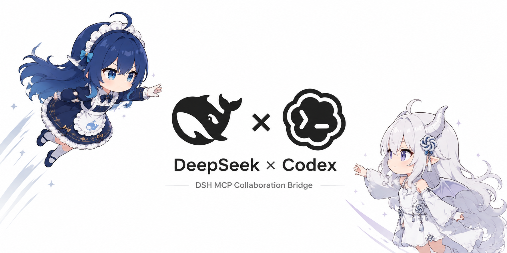
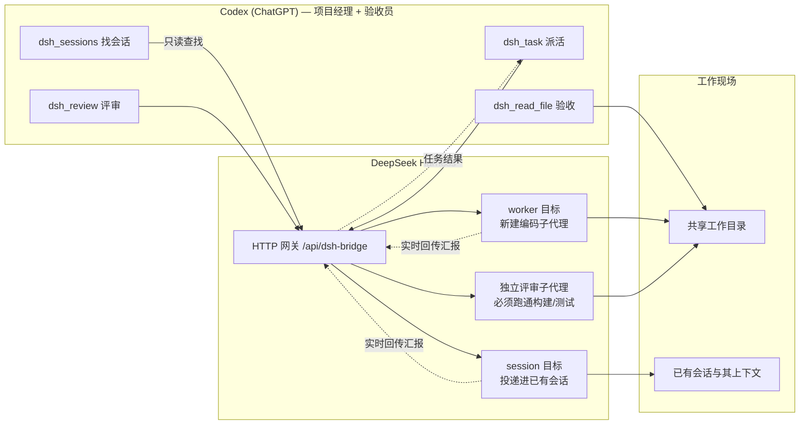

<p align="center">
  
</p>

# DSH Collab — Codex × DeepSeek Harness 双向编码协作

**Codex 主导，DeepSeek 执行，Codex 验收。** 一个插件体系，让 ChatGPT（Codex）像项目经理一样把编码任务派给本机 DeepSeek Harness 的编码子代理，实时回传结果，读文件验收，并由独立评审员实际跑通构建/测试后出具评审报告。

派活有**两种目标**，必须显式选一种——"接进用户正在用的那条对话"和"新建一个干活的子代理"是两件事：

| 目标 | 什么时候用 | 效果 |
|---|---|---|
| `worker`（默认） | 全新任务、独立项目目录 | 在 `--cwd` 里新建持久编码子代理（多工作区 · 多 lane · fast/pro 模型） |
| `session` | 用户已经在某条对话里推进这件事，你只是替他继续 | 指令**投递进那条会话**，沿用它的上下文，**不新建会话/工作区** |

```
Codex 工作区 (ChatGPT)
   │  dsh_task / dsh_sessions / dsh_review / dsh_read_file
   ▼
DeepSeek Harness 网关 /api/dsh-bridge
   ├─ worker 目标 ──→ 新建编码子代理（多工作区 · 多 lane · fast/pro）─┐
   ├─ session 目标 ─→ 已有那条会话（prompt 投递，queue / steer）  ──┤
   └─ 独立评审子代理（必须跑通构建/测试）───────────────────────────┴→ 共享目录 / 原会话
```


```mermaid
flowchart LR
    subgraph Codex["Codex (ChatGPT) — 项目经理 + 验收员"]
        A1[dsh_sessions 找会话]
        A2[dsh_task 派活]
        A3[dsh_review 评审]
        A4[dsh_read_file 验收]
    end
    subgraph DSH["DeepSeek Harness"]
        B1[HTTP 网关 /api/dsh-bridge]
        B2[worker 目标<br/>新建编码子代理]
        B3[session 目标<br/>投递进已有会话]
        B4[独立评审子代理<br/>必须跑通构建/测试]
    end
    subgraph FS["工作现场"]
        C1[共享工作目录]
        C2[已有会话与其上下文]
    end
    A1 -->|只读查找| B1
    A2 --> B1
    A3 --> B1
    A4 --> C1
    B1 --> B2 --> C1
    B1 --> B3 --> C2
    B1 --> B4 --> C1
    B2 -.实时回传汇报.-> B1
    B3 -.实时回传汇报.-> B1
    B1 -.任务结果.-> A2
```

---

## 组件

| 目录 | 内容 | 说明 |
|---|---|---|
| `codex-plugin/` | Codex 本地市场插件包 | 标准 marketplace 结构（`.agents/plugins/marketplace.json` + 插件目录），含协作技能 `dsh-collab` |
| `mcp/dsh-mcp.mjs` | MCP 服务器（零依赖 Node） | stdio 传输（Codex `[mcp_servers]` 直连）+ Streamable HTTP 传输（`--http`，供 Secure MCP Tunnel / cloudflared 桥接 ChatGPT）；6 个工具：`dsh_task` / `dsh_sessions` / `dsh_task_status` / `dsh_task_cancel` / `dsh_review` / `dsh_read_file` |
| `harness/dsh-bridge.mjs` | DeepSeek Harness 宿主组合网关插件 | 提供 HTTP 网关（`/api/dsh-bridge/*`）、WS 推送、原生工具；管理编码/评审子代理，并把任务投递进已有会话。**必须装进 harness 宿主组合**（见下文） |
| `harness/session-target.mjs` | 会话目标的纯决策层 | 目标判定、候选挑选（0/1/N 不猜）、RemoteError→稳定 reason、基线切分、汇报选文。无 DSH import，可单测；`dsh-bridge.mjs` 依赖它，**两个文件必须一起部署** |
| `test/` | 25 项 Node 测试 | `session-target` 纯函数单测 + `dsh-bridge` 路由级回归测试（假 DSH 运行时加载真实 bridge）。CI 每次都跑 |
| `templates/codex-mcp/` | 反向通道配置模板 | 把 Codex CLI 当 MCP 服务端挂进 DSH（得到 `mcp__codex__*` 工具），让 DSH 侧也能调用 Codex。见下文「反向通道」 |
| `cordis.patch.yml` | bundle patch | 把网关插件挂进 DSH 宿主组合；`dsh.bundle.patch` 指向它，所以 `dsh plugin add` 能自动 reconcile |

## 功能

- **派活**：`dsh_task` / `task.mjs`，任意工作目录（`--cwd`，不存在自动创建并注册为工作区）
- **接进已有会话**：`dsh_sessions` 只读搜索既有会话 → `dsh_task --session <id>` 把指令投递进去（`queue` 排队 / `steer` 插入当前回合）。**不新建会话、不新建工作区**；"找不到/接不上"一律返回稳定 reason 而不是静默新建
- **并行分工**：同目录多 lane（`--lane`）+ 跨目录天然并行
- **模型切换**：`fast`（deepseek-v4-flash）或 `pro`（deepseek-v4-pro），动态解析不写死
- **双向评审**：独立评审子代理与编码员分离，读磁盘真实文件、静态审查、**实际运行构建/测试验证可跑通**，输出结构化报告
- **Git 自动提交**：`--commit`，任务完成后在 cwd 自动 `git add -A` 并提交
- **跨任务记忆**：持久子代理会话 + 历史摘要注入（冷恢复失败自动降级为一次性执行，功能不中断）
- **任务管理**：`--list` / `--status <id>` / `--cancel <id> [--force]`
- **结果回传**：任务汇报直接回 Codex 对话（`--wait` 默认）；每个任务响应都回显 `target`，一眼看出是"新建"还是"接进哪条会话"

## 安装

### 0. 一条命令装全部（推荐，npm）

```sh
# 1) 网关插件装进 harness profile（自动 reconcile bundles，无需手工复制文件）
dsh plugin --profile desktop add @whaletalk/dsh-codex-collab
#    ↑ DSH 客户端用的就是 desktop profile；纯 Web 部署换成 --profile web

# 2) MCP 服务器交给 Codex
npm install -g @whaletalk/dsh-codex-collab
```

之后 `dsh-mcp` / `dsh-task` / `dsh-review` 三个命令进入 PATH，`~/.codex/config.toml` 里写：

```toml
[mcp_servers.dsh]
command = 'dsh-mcp'
startup_timeout_sec = 120
env = { DSH_BRIDGE_URL = "http://127.0.0.1:3080" }   # 见下方"端口"；不写则默认 3080
```

**端口**：网关挂在 profile 的 `webServer` 上，地址取决于 profile 怎么起的——独立 harness 通常 `3080`，而 DSH 客户端里就是 **GUI 自己的端口**（例如 `http://127.0.0.1:19387`）。MCP 与 CLI 都用 `DSH_BRIDGE_URL` 找网关，指错只会看到连接失败或 401。验证：

```sh
curl http://127.0.0.1:3080/api/dsh-bridge/status
```

装完**必须重启 profile 进程**——`dsh plugin add` 改的是 bundles 列表与 node_modules，HMR 不监控这两处；**替换包内容也不会热重载**（ESM 缓存），只有重启进程才加载新版本。

### 升级到新版本（有坑，照做）

```sh
# 1) 带精确版本号安装：不带版本号时 lockfile 会把旧版按回来
dsh plugin --profile desktop add @whaletalk/dsh-codex-collab@<新版本>
# 2) 重启 profile 进程：不重启不会加载新的 JS 模块
```

- **不要用"卸载 → 重装"**：卸载会把这个包从 `dsh.profile.bundles` 移除；重装后若没被重新选中，插件根本不会挂载（表现：所有 `/api/dsh-bridge/*` 都落到网关鉴权层返回 **401**）。真遇到了就在客户端插件页把它的开关打开。
- **刚发布的版本约 24 小时内装不上**：profile 的 pnpm 带 `minimumReleaseAge` 供应链冷却（`ERR_PNPM_MINIMUM_RELEASE_AGE_VIOLATION`）。管理器会把它写进 `pnpm-workspace.yaml` 的 `minimumReleaseAgeExclude` 才放行；手工安装可临时加 `--config.minimumReleaseAge=0`。

> 本包只提供 bundle patch，不含 profile 之外的强依赖：`@deepseek-ai/dsh-tools` 是 optional peer，由 DSH 安装树在运行时提供。因此 `npm install` 不会去 registry 拉它，也不会因它缺失而报错。

<details>
<summary>不想用 npm？仍可手工安装（源码方式）</summary>

### 1. DeepSeek Harness 网关（必需，后端）

把 **`harness/` 整个目录**复制到你的 dsh profile 目录（例如 `$DSH_HOME/profiles/web/` 下的 `harness/`），并在该目录的 `cordis.patch.yml` 中追加：

```yaml
- insert:
    - id: dsh-bridge
      name: './harness/dsh-bridge.mjs'
```

> `dsh-bridge.mjs` 会 `import './session-target.mjs'`——**两个文件必须在一起**，只复制前者会直接加载失败。

重启 harness。默认共享工作目录为 `D:\Harness`，可用环境变量 `DSH_BRIDGE_WORKSPACE` 覆盖。验证：

```
GET http://127.0.0.1:3080/api/dsh-bridge/status
```

> 手工方式必须用相对路径（文件就在 profile 目录里）；npm 方式则用包子路径 `@whaletalk/dsh-codex-collab/bridge`，两者不要混用。

### 2. Codex 侧（二选一或都用）

**A. MCP 工具（推荐，走 Codex 官方通道）**：把 `mcp/dsh-mcp.mjs` 放到本机任意位置，在 `~/.codex/config.toml` 追加：

```toml
[mcp_servers.dsh]
command = 'node'
args = ['<绝对路径>/dsh-mcp.mjs']
startup_timeout_sec = 120
```

重启 Codex，会话中出现 `mcp__dsh__*` 工具。

**B. 本地市场插件（技能形式）**：把 `codex-plugin/` 放到任意位置，在个人市场清单 `~/.agents/plugins/marketplace.json` 中追加插件条目（`"path": "./plugins/dsh"`），并把插件目录放到 `~/plugins/dsh/`，然后：

```bash
codex plugin add dsh@personal
```

npm 安装后，插件目录已在包内，用一行拿到绝对路径：

```bash
node -p "require.resolve('@whaletalk/dsh-codex-collab/package.json').replace(/package\.json$/,'codex-plugin')"
```

> ⚠️ 已知问题：Codex Desktop 26.803 在 Windows 上存在插件技能不注入会话的 bug（[openai/codex#26037](https://github.com/openai/codex/issues/26037)、[#22078](https://github.com/openai/codex/issues/22078)）。技能形式可能不生效，**以 MCP 方式为准**。

### 3. ChatGPT 普通聊天区（可选，受账户限制）

ChatGPT 不能直连 localhost MCP。官方通道是 [Secure MCP Tunnel](https://github.com/openai/tunnel-client)：

1. 在 `https://platform.openai.com/settings/organization/tunnels` 创建隧道（需组织上下文），创建 Runtime API key；
2. 启动本地 HTTP MCP：`node dsh-mcp.mjs --http 127.0.0.1:4800`；
3. 启动隧道客户端（含 `HTTPS_PROXY` 环境变量若需代理）：

```bash
tunnel-client init --sample sample_mcp_remote_no_auth --profile dsh --tunnel-id tunnel_xxx --mcp-server-url http://127.0.0.1:4800/mcp
tunnel-client run --profile dsh
```

4. ChatGPT → 设置 → Connectors 中连接。

> 注意：写入型 MCP 工具对 ChatGPT 个人订阅（Plus）的开放度存在产品级限制，此路径仅供有能力/有组织的账户使用。

</details>

## 使用

**Codex 工作区会话**（MCP 工具就绪后）：

> **新建子代理**：用 dsh_task 让 DeepSeek 生成一个随机密码 CLI + 测试 + README，放在当前项目目录，完成后你用 dsh_read_file 验收，再 dsh_review 评审
>
> **接进原对话**：先用 dsh_sessions 按标题找到用户正在用的那条会话，再用 dsh_task 带 sessionId 把下一步指令投递进去（不要新建会话）

**MCP 工具**（Codex 侧首选，工具名带 `mcp__dsh__` 前缀）：

```jsonc
// 1) 找到会话（只读）
dsh_sessions({ "query": "按文档启动OKX策略实验计划" })
// → { "items": [{ "sessionId": "session-example-…", "snippet": "按文档启动OKX策略实验计划",
//                 "agentAvailable": true }], "matchedBy": "list" }

// 2) 投递进那条会话
dsh_task({ "instruction": "继续推进第 3 步…", "sessionId": "session-example-…" })
// deliver 可选 "queue"（默认，排队）或 "steer"（插入当前回合）
```

**命令行**（npm 安装后直接用；源码方式用 `node <脚本路径>`）：

```bash
# 新建子代理（默认行为）
dsh-task --in "<指令>" --cwd "<目录>" [--lane backend] [--model fast|pro] [--commit]

# 接进已有会话：先找（或先空跑验证），再派
dsh-task --sessions "<标题关键词>"                    # 只读列候选，拿 sessionId
dsh-task --dry-run --find "<标题关键词>"               # 只解析目标、回显命中，不投递任何消息
dsh-task --in "<指令>" --session "<sessionId>" [--steer]
dsh-task --in "<指令>" --find "<标题关键词>"           # 唯一命中才派；否则退出码 4

dsh-review --cwd "<目录>" [--diff git|@文件|"diff文本"] [--focus "<重点>"]
dsh-task --list | --status <taskId> | --cancel <taskId> [--force]
```

**已有会话派活**（对应"接进我正在用的那条对话"）：

```bash
# 1) 找到（只读，不创建任何东西）
dsh-task --sessions "按文档启动OKX策略实验计划"
# → {"items":[{"sessionId":"session-example-…","snippet":"按文档启动OKX策略实验计划",
#              "agentAvailable":true}],"total":1,"matchedBy":"list"}

# 1b) 没命中时会给近似候选（按标题相似度 + 最近更新排序），换词重查或改用 sessionId——
#     绝不要发一条消息去"试探命中"（它会落进对方会话并跑成回合，污染对话）
dsh-task --dry-run --find "量化框架"
# → {"resolved":false,"reason":"session-query-empty",
#    "candidates":[{"sessionId":"1c0f99f8-…","snippet":"你是一个量化研究项目的技术","score":0.333}, …]}

# 2) 接通（投递进那条会话；这一轮的助手回复作为汇报返回，只回报本轮新增文本）
dsh-task --in "<继续推进的指令>" --session "session-example-…"
```

`matchedBy` 说明"找到"走了哪条路：`search` = 会话搜索索引；`list` = 索引被部署禁用时退回遍历列表 + 标题投影（都不激活 Agent）。

**`delivered` 与排队语义**（重要）：`prompt` 一旦被目标会话接受，就表示消息**已经进了它的队列**，响应里会带 `delivered: true`；此后即便我们的观察超时（会话可能正跑一个很长的回合），也**不要重发**——重发会让同一份内容在用户会话里出现两次。`queue` 模式不再用 120s 判失败：没在 120s 内开跑只记一条 note 并继续等，最终由总预算（默认 1h）收口为 `session-timeout` + `delivered: true`。

失败返回稳定 `reason` 且**不创建任何会话/工作区**：`session-query-empty`（没命中，附 `candidates`）、`session-ambiguous`（多条命中，附 `candidates`）、`session-not-found`、`session-busy`、`session-writer-held`（会话被别的写入方占用）、`session-archived`、`session-not-accepted`（仅当 prompt **未被接受**）、`session-timeout`、`session-cancel-refused`（取消会话目标默认被拒，需 `--force`）。

## 反向通道：让 DSH 调用 Codex

上面的链路都是 **Codex → DSH**。反过来的 **DSH → Codex** 也能做，但要分清两种含义：

| 含义 | 可行性 |
|---|---|
| 让 DSH 调用 Codex（把 Codex 当执行器/评审员） | ✅ 两端原生支持，见下 |
| 让 DSH 往你**正开着的某条 ChatGPT/Codex 对话**里插一条消息、就地开一轮 | ❌ 做不到 |

第二种做不到的原因：现有链路是 Codex 主动（它启动 `dsh-mcp` 子进程调工具），而 MCP 是
**客户端发起**的协议——服务端无法命令客户端开一轮。服务端→客户端只有 `notifications/*`
（纯通知，不触发回合）、`sampling/createMessage`、`elicitation/create`（取决于客户端是否
实现，且不等于"在对话里跑工具"）；ChatGPT 侧同样没有公开 API 能向用户会话投消息。

### 方案 A：反向通道已内置在本包里（推荐）

**装本包就同时得到两个方向**——`cordis.patch.yml` 里插了两行：`dsh-bridge`（Codex → DSH 派活）与 `codex-mcp`（DSH → Codex 反向调用）。原理是两端各有一个原生件：

- DSH 侧 `@deepseek-ai/dsh-mcp-client`（harness 自带）：连外部 MCP 服务器，并把工具以 `mcp__<serverName>__<tool>` 注册进 `ctx.tools`；
- Codex 侧 `codex mcp-server`（stdio）：把 Codex 暴露成 MCP 服务端。

内置的那一行等价于：

```yaml
- insert:
    - id: codex-mcp
      name: '@deepseek-ai/dsh-mcp-client'
      config:
        serverName: codex
        transport: stdio
        command: codex                 # 跨平台：SDK 用 cross-spawn，Windows 的 .cmd 垫片也能解析
        args: ['mcp-server']
        failOnStartupError: false      # 没装/没登录 Codex 只是没这批工具，不会拖垮 harness
        toolCallTimeoutMs: 600000      # 默认只有 60s，Codex 跑一轮常常不够
```

- 前提：本机装了 Codex CLI 并已登录（`codex --version` / `codex mcp-server --help` 能跑）。
- **不需要反向通道**？在 profile 的 `cordis.patch.yml` 里覆盖一行即可关掉：`- id: codex-mcp` + `disabled: true`。
- 想单独用反向通道（不装本插件主体）可以用独立模板 [`templates/codex-mcp/`](templates/codex-mcp/README.md)。
- 装完需**重启 profile 进程**；连接失败只是这批工具不出现（日志里有原因）。
- 排查：若 `codex` 不在 DSH 进程的 PATH 上，把 `command` 换成 `node` + `args: ['<...>/@openai/codex/bin/codex.js', 'mcp-server']`，或直接指向平台 `codex.exe`。

### 方案 B：worker 里直接跑 `codex exec`

```powershell
codex exec "把刚才的 diff 审一遍，只回结论" --cd E:\proj
```

一次性、零协议改动；代价是每次都是新会话（无跨轮记忆），且需要执行 shell 的权限。

> 注意：插件自带的 `dsh_collab_send` / `dsh_collab_review` 是 **DSH 侧入口**，只回到同一个网关，**不经过 Codex**。要"叫 Codex 干活"用上面 A/B；要"让 Codex 那条对话继续"，只能等 Codex 自己下一轮（`dsh_task --wait` 或 `dsh_task_status`）。

## DSH → Codex 收件箱（桌面自动唤醒：blocked）

目标形态是"DSH 主动往 Codex Desktop 正在用的那条聊天发一条消息，并让它开始处理"。**M0 实测本机做不到**：桌面 app-server 以默认 `stdio://` 启动、端点归 `ChatGPT.exe` 私有，既没有 `--listen` 出的 ws/TCP 端点，也没有文档所说的 app-server 控制套接字——详见 [`docs/codex-desktop-attachment-evidence.md`](docs/codex-desktop-attachment-evidence.md)。

因此先交付可独立验证的一半（用法见 [`docs/DSH_TO_CODEX_INBOX.md`](docs/DSH_TO_CODEX_INBOX.md)）：

```bash
node mcp/codex-desktop-probe.mjs --schema        # 只读能力探针：还要不要继续谈唤醒，看它
node mcp/codex-inbox.mjs capabilities            # 能力如实上报：deliveryMode=inbox, canWakeIdle=false
node mcp/codex-inbox.mjs bind --binding <id> --thread <codexThreadId> [--source <DSH会话id>]
node mcp/codex-inbox.mjs send --binding <id> --text "<正文>" [--key <幂等键>]
node mcp/codex-inbox.mjs pending                 # Codex 侧/用户主动来读
```

- 收件箱：追加型事件日志 + **单把独占写锁**（幂等检查 / seq 分配 / 绑定更新 / 追加都在锁内）。
  锁是 `<root>/.write.lock` 这个共享路径上的**一次原子独占创建**（硬链接发布 / `wx`），谁创建成功谁进临界区；
  **在线竞争期间绝不自动回收**（"检查共享路径再删除"无法原子化，会删掉别人刚建的新锁）。
  持有者活着 → 有限等待后 `lock-timeout`；持有者已死 → **二次确认**后 `lock-stale-holder`；元数据不可确认 → `lock-unverified-holder`；
  后两者都是**可恢复错误 + 人工清理**（文档给了步骤），宁可阻塞也不冒双写者风险。
  追加前修复**记录边界**，残尾不会吞掉后续写入；状态机 `queued → delivered → acked`（另有 `failed` / `delivery-unknown`）；
  存储损坏明确报错，不伪装成空收件箱。
- **未绑定一律拒绝**，不猜目标、不从最近使用里挑默认；授权线程 ID 只存在于本地绑定，不作为发布默认值。
- CLI 参数严格：带值旗标缺值或未知旗标一律 exit 2，且在打开存储之前拒绝。
- 明确不宣称：**自动唤醒、观察回合事件均未实现**；死持有者需人工清理（非自动恢复）、断电级持久性、
  跨机（网络文件系统）锁语义均未验证/不自动（见用法文档 §4）。
- 现有六个 MCP 工具与 `dsh_collab_send` 语义未改动。

验证：`node test/codex-outbox.test.mjs`（24 项，含真多进程并发、6 进程压测、活持有者期间零写入）、
`node test/codex-inbox-cli.test.mjs`（6 项）、`node test/codex-desktop-probe.test.mjs`（11 项，含采集层失败判定）、
`node mcp/codex-desktop-probe.mjs --schema`（现场能力报告）。

## 来源关联：Codex 对话 → 任务 → 结果（跨回合精确收取）

"本来就是 Codex 驱使 DSH 派活"这件事现在有**显式身份**了：派活时带上发起对话 id（`originThreadId`），
网关在**执行前**把「来源对话 → taskId → 执行目标」持久落盘；之后任何回合（哪怕是新的 MCP 进程、网关重载后的新实例）
都能按 `originThreadId + taskId` 精确取回这次任务的结果。详见 [`docs/CODEX_DSH_TASK_REPLY_PLAN.md`](docs/CODEX_DSH_TASK_REPLY_PLAN.md)。

```bash
# 派活（MCP 工具 dsh_task / dsh_review 的 originThreadId 参数同理，必须显式传当前对话 id）
dsh-task --in "<指令>" --cwd "<目录>" --origin "<当前 Codex 对话 id>"

# 下一个回合：只凭来源找回 taskId，再精确取结果
dsh-task --my-tasks --origin "<当前 Codex 对话 id>"
dsh-task --status "<taskId>" --origin "<当前 Codex 对话 id>"
```

- **持久关联记录**：`{originThreadId, taskId, target, status, createdAt, updatedAt, delivered, result/error}`，
  追加型 JSONL + 与收件箱**同一套独占写锁**；位置在用户数据目录 `~/.dsh-codex-task-assoc/<namespace>/bindings.jsonl`
  （`DSH_CODEX_TASK_ASSOC_DIR` / `DSH_BRIDGE_ASSOC_NAMESPACE` 可覆盖；**测试全部用临时 root，绝不默认写仓库**）。
  namespace 是**校验过的短标识**且 origin/taskId 从不参与路径拼接；日志追加 + taskId 全局唯一 ⇒ 多个网关不会互相覆盖记录。
- **绑定不可改投**：同一 taskId 换来源直接拒绝；`originThreadId` 必须是合法非空字符串——**字段未传**才是旧的无关联模式，
  显式给空串 / null / 纯空白 / 非字符串一律在执行前拒绝（`invalid-origin`），绝不静默回落或改用环境变量。
- **执行前落盘**：首次持久绑定失败就**不启动 DSH 执行**（绝不出现"执行了却没绑定"）；终态/失败/取消/交付确认都写回。
- **派活前只读核验网关能力**：`/status`、`/tasks`、`/debug` 上报 `capabilities.originBinding.supported`；
  MCP/CLI 带来源时必须先确认它为 true（**不靠包版本猜**）——旧网关会忽略 `originThreadId` 却照常返回 accepted，
  从而产生未绑定任务，所以不支持时**零执行拒绝**。旧的无来源调用完全兼容。
- **会话任务的结果归属**（带来源时）：不能再用"派发前基线 + 全会话 idle"（那会把别的请求的输出算给当前 taskId）。
  改用 `prompt.requestId`（=taskId）→ DSH 的 `user/message.source.rpcId` → 按 `seq` 有序跟踪未闭合回合 → 只收**自己那个 turn** 的助手文本，
  并且**只有该 turn 的 `turn/end.reason.kind === 'completed'` 才算成功**（其余 aborted/blocked/error/max-tokens/interrupted/forked 是明确失败，
  部分文字放 `partialResult`）。follow 开场的 `snapshot.records` 也会被检查（快任务可能已经跑完）；`api-session/status` 只当作"读一次日志的机会"，
  **不是**完成证明。落盘并回显（内存分支与恢复分支都给）：`requestId`（=taskId）与匹配到的 `dshTurn`；
  `turnEndKind`/`partialResult` 以及未确认时的 `resend`/`note` **只在活任务的内存响应里**出现（不在持久记录里；
  重启后非终态记录由恢复分支合成 `unknown` + `resend:false`）。
- **带来源时拒绝 `steer`**（`origin-steer-unsupported`，执行前拒绝、零投递）：steer 会把一批请求合进同一个回合，无法为单个请求保证归属。
- **没有证据就是未确认**：无匹配 `rpcId` 的终态、quiet/预算到期 → `status:"unknown"` + `resend:false`，绝不猜 done、绝不重发。
- **网关必须回显并匹配 `originThreadId` 才算确认绑定/取值**：能力检查通过≠这次绑定成功（网关可能中途重载/旧 handler）。
  未确认时 MCP/CLI 都按"未确认 + 禁止重发"上报（CLI 退出码 8），**不返回**那种响应里的结果。
- **读结果必须匹配来源**：缺来源 → `origin-required`、错来源 → `origin-mismatch`（内存与重启后一致，`/cancel` 同样检查），
  **绝不返回别的对话的结果**；只有真正未关联的旧任务保持"只给 taskId"兼容查询。
- **同一通道（cwd+lane，评审=目录）同时只允许一个在途任务**：第二个明确 `worker-bucket-busy` / `reviewer-bucket-busy` 拒绝——
  完成事件只能归属到通道里最老的那个任务，并发派活会让结果归属变成猜测。不同 lane/目录仍并行；上一任务结束后可继续复用同一子代理。
- **恢复边界**：已完成结果在网关重载/新实例后仍能按 `origin+taskId` 取回；**没跑完**的任务（精确查询或只给来源列表）一律返回
  `status: "unknown"` + `resend: false`（执行/交付状态未能确认，保留已知 `delivered` 与原目标），**不谎报完成、不自动重发、不去猜 DSH 最近助手文本**。
  内存 200 条上限只淘汰**终态**任务（活任务永不被挤掉），持久记录不受影响。
- 不按"最近/标题/时间"猜发起对话；`taskId` 是关联标识，**不是授权凭据**，也不等于线程 id。
- **自动唤醒仍然 `false`**：来源关联解决的是"派活回报精确归属"，不是"唤醒空闲桌面聊天"。

验证：`node test/codex-r1-contracts.test.mjs`（8 项：非法来源零执行、已关联任务缺/错来源拒绝、通道 busy、旧网关零执行拒绝、能力上报、
能力通过但未确认来源 → 未确认+禁止重发、列表 unknown 语义、CLI 严格参数）、
`node test/codex-session-correlation.test.mjs`（8 项：真实 SDK 字段的请求↔回合关联：排队请求忽略先前回合、只有自己 turn/end 才完成、
error/blocked 不得 done、snapshot.records、重复投递不串文本、快照缺前半段回填、无匹配 rpcId → 未确认、steer 拒绝）、
`node test/codex-association-e2e.test.mjs`（3 项：**真实 HTTP + 独立 MCP 进程 + 独立 CLI 进程** 的跨回合收取与重启恢复）、
`node test/codex-associations.test.mjs`（13 项：存储/不可改投/来源校验/失败不泄漏 record/跨重启/命名空间隔离/真多进程并发/任务表淘汰）、
`node test/dsh-bridge.test.mjs`（13 项：非法来源 400、执行前落盘、新实例恢复、200+ 记录、存储故障拒绝派活）。

## 环境变量

| 变量 | 默认 | 说明 |
|---|---|---|
| `DSH_BRIDGE_URL` | `http://127.0.0.1:3080` | 网关地址。**必须指向插件实际挂载的那个 profile 的端口**（DSH 客户端里就是 GUI 端口，例如 19387） |
| `DSH_BRIDGE_WORKSPACE` | `D:\Harness` | 网关默认共享工作目录 |
| `DSH_BRIDGE_ROOT` | `D:\Harness` | `dsh_read_file` 相对路径基准 |
| `DSH_BRIDGE_HISTORY` | 多级降级 | 协作历史文件位置（默认 D 盘 → 用户目录 → 临时目录逐级降级） |
| `DSH_BRIDGE_SESSION_DISPATCH_TIMEOUT_MS` | `120000` | 会话任务被接受后、迟迟没开始跑的容忍时间（仍在排队则报 `session-not-accepted`） |
| `DSH_BRIDGE_SESSION_QUIET_TIMEOUT_MS` | `600000` | 见过 running 之后多久没有新助手文本算跑完 |
| `DSH_BRIDGE_SESSION_TOTAL_TIMEOUT_MS` | `3600000` | 单个会话任务的总预算 |
| `DSH_CODEX_TASK_ASSOC_DIR` | `~/.dsh-codex-task-assoc` | 任务关联记录的存储根（**默认只在用户目录，绝不写仓库**） |
| `DSH_BRIDGE_ASSOC_NAMESPACE` | `default` | 关联记录的命名空间（`[A-Za-z0-9._-]{1,64}`）；多 profile 可各自一个来分隔存储 |

## 已知限制

- 网关插件需要 `webServer` 服务（由 `dsh-web-app` 提供），因此**只能挂 web / desktop profile**；headless profile 会一直 pending。session 目标还需要 `sessionController`——它由组合**异步注册**（`webserver → web-runtime → connection → file-upload → session-controller`），所以插件是惰性取用，注册前调用会返回 `session-controller-unavailable`（稍后重试即可）
- **`sessionController.search` 可能被部署禁用**（`session-query` 索引 `openAt: "never"`）。此时按标题查找自动退回 `list`（读持久化 header + 标题投影，同样不激活 Agent），响应里的 `matchedBy` 标明走了哪条路
- **不能投递进子代理会话**：`resolveAgent` 对 subagent 路由拥有的会话返回 `session-busy: owned by subagent routing`；只能接普通会话
- `POST /api/dsh-bridge/sessions {"create": true, "cwd": "..."}` 可新建一条空白会话（探针/一次性任务用），它不会碰任何已有会话
- **同一会话同时只允许一个在途 bridge 任务**：DSH 自己会排队，但无法可靠地把两次并发派活的回报各自归属，所以第二个会被明确拒绝（`session-busy`）而不是猜
- **冷会话可能接不上**：DSH 激活 Agent 需要会话投影（`Agent activation requires a projected Session observation`），未激活的会话会返回 `session-not-activatable`；归档会话的回合会以 `blocked` 收口（`session-archived`）
- **评审不支持会话目标**：评审员必须与编码会话隔离，"独立评审"才成立
- session 目标不使用 `cwd`/`lane`/`model`/`--commit`（会话自带这些语义），传了会被判 `invalid-target`
- 网关重启会丢失内存中的任务表（含 session 观察器），这是既有设计；**但来源关联任务的终态结果在持久记录里**，重启后仍可按 `origin+taskId` 取回；没跑完的会明确返回 `unknown` + `resend:false`（不谎报、不重发）
- 关联记录只对**显式带 `originThreadId`** 的派活生效；不带来源的旧任务是"无关联"的（只能按 taskId 查活在内存里的状态，查询到就返回 0，查不到退出码 6）
- 恢复路径**不重新观察**已失去运行时上下文的活任务（未实现），因此这类任务只能得到 `unknown`；要去现实里确认就自己去看目标会话/工作目录——**不要重发**
- **同一通道同时只允许一个在途任务**（含评审：同一目录一个）：第二个被 `worker-bucket-busy` / `reviewer-bucket-busy` 拒绝，避免完成结果被猜给错误的任务。这是为了保护结果归属，代价是"同 lane 快速连发"需要等前一条结束（或换 lane）
- **MCP 侧用 `fetch` 调网关**：若网关端口落在 fetch 规范的禁用端口（`1/7/9/…/6000/6665-6669/6697/10080` 等），undici 会直接以 `bad port` 拒绝连接（表现为"网关在跑但 MCP 全部失败、且没有任何网关日志"）。默认端口（3080 / GUI 端口）不受影响；CLI 用 `node:http`，不受该限制。
- **替换包内容不会热重载**：升级后必须重启 profile 进程，否则跑的还是旧 JS 模块（HMR 只重挂组合，不复用新代码）
- **组合包被取消选中 = 插件完全不挂载**：此时所有 `/api/dsh-bridge/*` 都落到网关鉴权层返回 401（不是 404，容易误判成没装）
- **DSH profile 的 pnpm 供应链冷却**：新发布的版本约 24 小时内会被 `minimumReleaseAge` 拒绝安装（`ERR_PNPM_MINIMUM_RELEASE_AGE_VIOLATION`）；管理器会把它写进 `pnpm-workspace.yaml` 的 `minimumReleaseAgeExclude` 才放行。刚发版就装不上属正常，不是包的问题
- 升级已装组合包：客户端插件页没有升级入口，官方姿势是**卸载 → 重装**；但卸载会把该包从 `dsh.profile.bundles` 移除，重装后**要确认它被重新选中**，否则插件不会挂载（表现为所有 `/api/dsh-bridge/*` 都落到网关鉴权层返回 401）。更省事的做法是直接 `dsh plugin add <包>@<版本>`，见上文「升级到新版本」
- Codex Desktop Windows 本地市场技能注入 bug（见上，MCP 通道不受影响）
- 动态插件环境无 `AbortSignal`，冷恢复失败时自动降级为一次性执行；宿主组合持久化版无此问题
- ChatGPT Plus 写入型 MCP 的开放度取决于 OpenAI 产品策略

## 开发与测试

```sh
node test/session-target.test.mjs      # 纯函数：目标判定 / 候选挑选 / 错误映射 / 基线切分 / 汇报选文
node test/dsh-bridge.test.mjs          # 路由级：假 DSH 运行时 + 桩 peer，加载真实 bridge 跑真实路由
node --test test/*.test.mjs            # 两个一起跑（CI 用的是这条）
```

- 路由级测试会断言 **worker 分支确实调用了 `startContinuable`**、**session 分支只调用 `prompt` 且不建 owner/子代理**——这类"参数遮蔽/串线"缺陷只有在这一层才抓得到（v0.1.2~0.1.4 的 `deliver` 遮蔽 bug 就是它抓回来的）。
- CI（`.github/workflows/publish.yml`）每次 tag 都跑：语法检查 → 单测 → 包契约 → 版本号三处一致 → tarball 清单 → 干净目录安装 + CLI/MCP 冒烟 → 6 工具握手断言 → bridge 导出契约。**任何一步失败都不会发布**。
- 发布：`package.json` / `.codex-plugin/plugin.json` / `mcp/dsh-mcp.mjs` 的 `SERVER_VERSION` 三处同步改版本 → commit → 打 tag `vX.Y.Z` → 推 tag，CI 自动带 provenance 发布。

## License

MIT
